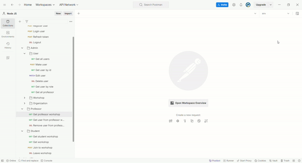
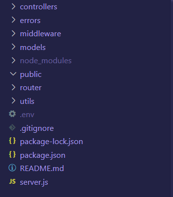

# Node Code School



Basic Node.JS + Express API project created for [Code school app](https://github.com/Roko03/code-school).
Includes:
- Authentication route providing [JWT token](https://jwt.io/)
- Routes for managing users, workshops and organizations based by role(admin, student and professor)

# Summary

For this project, firstly I need to find best model of folder structure for Node application. 



- **Controllers:** Organize route handlers and logic that handle HTTP requests
- **Errors:** Define API error
- **Middleware:** Implement middleware functions for tasks
- **Models:** Define data model 
- **Router:** Define API endpoints
- **Utils:** Utility functions or modules used across applications like connection to database
- **`.gitignore`:** File used to mention the modules which will be ignored by GIT
- **`.env`:** Store environment variables
- **`server.js`:** Starting point of application

**Environment**

For require environment variable in application, I use [dotenv](https://www.npmjs.com/package/dotenv) package that I need to invoke in `server.js` file.

```javascript
require("dotenv").config();
```

```bash
MONGO_URI=mongo_connection
ACCESS_TOKEN_SECRET=random_secret_key
REFRESH_TOKEN_SECRET=random_secret_key
JWT_ACCESS_LIFETIME=**
JWT_REFRESH_LIFETIME=**
```

For generate random secret key I run this command in terminal

```bash
node -e "console.log(require('crypto').randomBytes(32).toString('hex'))"

```

**Errors**

Creating custom errors allows for more meaningful error messages. I developed a CustomAPIError class that accepts a message as an argument. This class is extended in various files, such as bad-request.js, utilizing the [http-status-codes](https://www.npmjs.com/package/http-status-codes) package to assign appropriate status codes. I also install [express-async-errors](https://www.npmjs.com/package/express-async-errors) package for handle async error in Express.

```javascript
class CustomAPIError extends Error {
  constructor(message) {
    super(message);
  }
}

module.exports = CustomAPIError;
```

**Modules**

I create six module file in modules folder that are mongoose schema for creating database table.
- **LoginWorkshop** - mongoose schema to get a list of users that enrolled in a workshop
- **Organization** - mongoose schema for organization
- **Session** - mongoose schema for storing login user and their session data
- **User** - mongoose schema for users where I use [bcryptjs](https://www.npmjs.com/package/bcryptjs) package for password hashing
- **UserOrganization** -mongoose schema for connect user with organization many to many
- **Workshop** - mongoose schema work workshops

**Middleware**
- `authentication.js` - Check if the Bearer token is verified and enable some routes if exists
- `error-handler.js` - Return to page based by error
- `not-found.js` - Return to not found page(404) page
- `role-authentication.js` - Check the role of the user and enable some routes based on the role

**Routes**

In this project, I defined routes for three distinct user roles, each protected by role-based authentication middleware. This middleware ensures users can only access routes and perform actions their roles permit. In the router folder, I set up endpoints and CRUD operations, invoking functions from controllers to handle GET, POST, PUT, and DELETE requests.

# Project Structure
- **Folders and Files:** The project follows modular structure for folder with the model-view-controller pattern
- **Technologies Used:** JavaScript, Express.js
- **CRUD operations:** Four basic operations(Create, Read, Update, Delete)
- **Database:** The project is connected with [MongoDB](https://www.mongodb.com/) and use Object Data Modeling(ODM) library [Mongoose](https://mongoosejs.com/)
- **JWT authorization:** The project features an authorization system using access and refresh token. For creating JWT access and refresh token we use [jsonwebtoken](https://www.npmjs.com/package/jsonwebtoken) that have options to create and validate token
- **Considerations:** The main focus of this project was to develop a practical understanding of Node.JS and Express.JS and how to create the MERN application by implementing JWT authorization

## Time Spent

I need 50-60 hours of work to make this project.

# How to Use
Make sure you have the following installed on your computer:

- [git](https://git-scm.com/)
- [node.js](https://nodejs.org/en)
- [npm](https://www.npmjs.com/)

Clone the repository

```bash
git clone https://github.com/Roko03/node-code-school.git
```

Make sure that you install all packages from `package.json`

```bash
npm install
```

Running the Project
```bash
npm run start
```

Running the Project by automatically restarting. Make sure you have installed [nodemon](https://www.npmjs.com/package/nodemon).
```bash
npm run dev
```
Open [http://localhost:3000](http://localhost:3000/) to view the project
